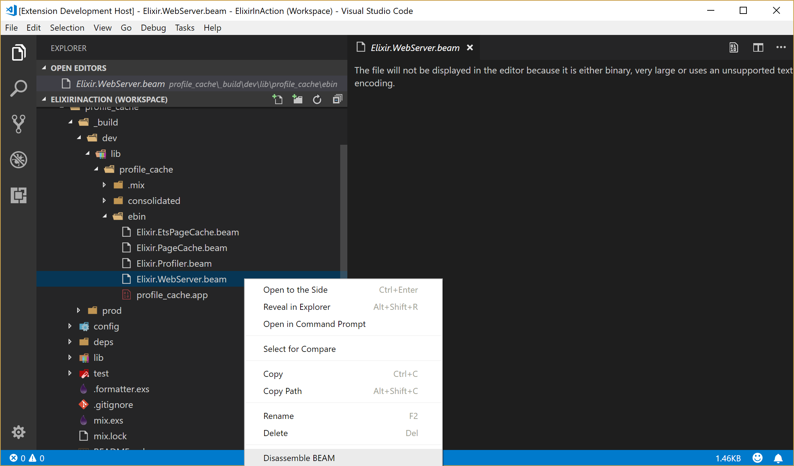
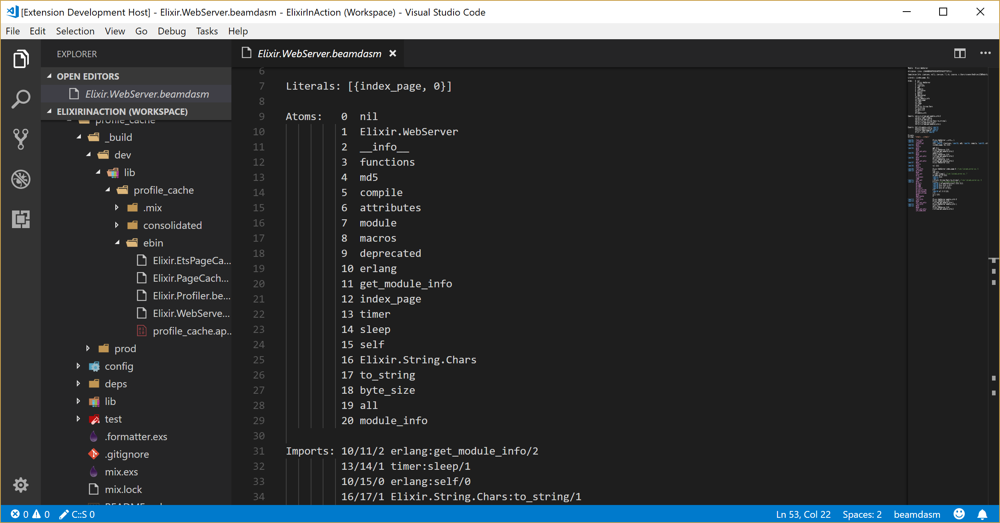
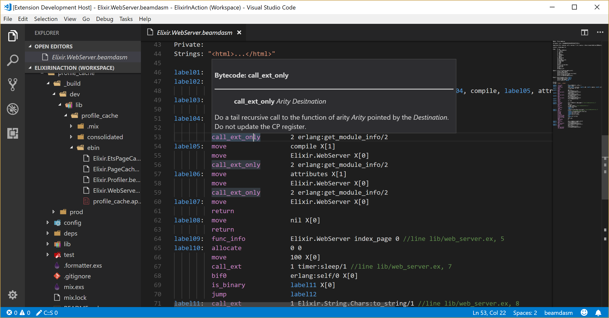

# BEAMdasm

BEAM files disassembler extension for Visual Studio Code

## Description

This extension allows to "peek" inside compiled bytecode for BEAM (Bogdan/Björn Erlang Abstract machine).

## Features

To activate the extension select "Disassemble BEAM" from the context menu for a .beam file in the Explorer View:

## Requirements

If you have any requirements or dependencies, add a section describing those and how to install and configure them.

## Extension Settings

None

## Known Issues

None

## Release Notes

Initial previe release

## License

[Apache 2.0](LICENSE.md)