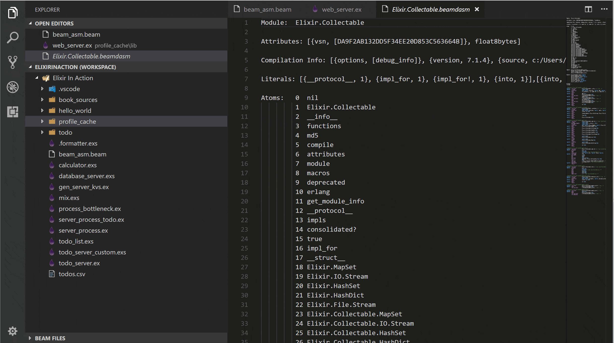
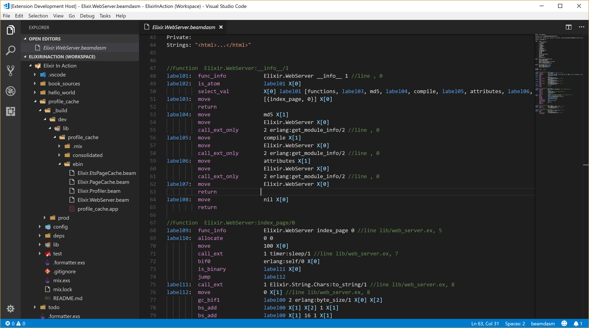

# BEAMdasm

BEAM files disassembler extension for Visual Studio Code.

## Description

Erlang\Elixir bytecode viewer.
This extension allows to "peek" inside compiled bytecode for BEAM (Bogdan/Björn Erlang Abstract machine) binary files.

## Features

- Dedicated View in the Explorer for all .beam files in the workspace
  - Subitems for main sections:
    - Atoms ('**Atom**' and '**AtU8**' sections)
    - Exported functions ('**ExpT**' section)
    - Imported functions ('**ImpT**' section)
    - Local functions ('**LocT**' section)
    - Strings '**StrT**' section)
    - Attributes ('**Attr**' section)
    - Literals ('**LitT**' section)
- Opcodes, labels, registers highlighting
- Hover description for opcodes taken from erlang source code  (when available)
- Gutter images for start of the functions

To activate the extension select "Disassemble BEAM" from the context menu for a .beam file in the Explorer View:

## Requirements

Visual Studio Code 1.21.0

## Extension Settings

None

## Known Issues

None

## Release Notes

Initial previe release

## Contributing

1. Fork 
2. Create your branch
3. Commit your changes
4. Push to the branch
5. Submit a pull request
6. (Optional) Send me a beer

## License

[Apache 2.0](LICENSE.md)